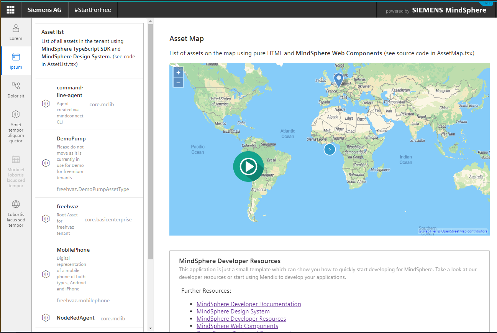

<!-- @format -->

# MindSphere Start For Free Demo App

This is a simple [React](https://reactjs.org/) application which was bootstrapped
with [Create React App](https://github.com/facebook/create-react-app).

You will need nodejs and npm installed on your computer. You can get them at [https://nodejs.org/](https://nodejs.org/).

The application showcases the use of

-   [MindSphere Developer Documentation](https://developer.mindsphere.io)
-   [MindSphere Design System](https://design.mindsphere.io)
-   [MindSphere Developer Resources](https://developer.mindsphere.io/resources/index.html)
-   [MindSphere Web Components](https://developer.mindsphere.io/resources/mindsphere-webcomponents/index.html)
-   [Open Source Tools and Components](https://opensource.mindsphere.io)
-   [TypeScript SDK](https://opensource.mindsphere.io/docs/mindconnect-nodejs/sdk/index.html)
-   [Development Proxy](https://opensource.mindsphere.io/docs/mindconnect-nodejs/cli/development-proxy.html)

## Installing the dependencies

### `npm install`

Run `npm install` in your development shell to install the app dependencies.

## Running Application in Development environment

Run in two different shells the following commands `npm run dev` and `npm run proxy`

### `npm run dev`

Runs the app in the development mode.
Open [http://localhost:3000](http://localhost:3000) to view it in the browser.

The page will reload if you make edits.
You will also see any lint errors in the console.

### `npm run proxy`

Proxies and authenticates all calls to MindSphere APIs on [http://localhost:7707](http://localhost:7707)
You will have to copy the [authentication cookies from MindSphere first](https://opensource.mindsphere.io/docs/mindconnect-nodejs/cli/development-proxy.html#tab1anchor1)

```bash
export MDSP_HOST="castidev-sdk-castidev.eu1.mindsphere.io"
export MDSP_SESSION="NzBi...Zl"
export MDSP_XSRF_TOKEN="fed5edc5-...2565238c114"
```

There is a chrome extension [MindSphere Authetication Helper](https://opensource.mindsphere.io/docs/mindsphere-auth-helper/index.html)
which can help you copy the cookies to the command line.

This will let you develop the application in your development environment, while using the user credentials from the deployed app. You have to
register and optionally deploy your app at least once so that you can get the application cookies.

When registering the app (Follow the **Start App Integration** path in the **Tour Guide**) configure the StandardUserRole for your users.
This will allow the logged in users to call the AssetManagementAPI which is used in this application.


As this is a pure frontend application you will only need the user cookies to start developing your application.
(See [MindSphere Developer Documentation](https://developer.mindsphere.io/concepts/concept-authentication.html) for MindSphere authentication concepts.)

The diagram below shows the local setup:


How to run the application in your local development environment (click on the image below to go to the video)

[](https://opensource.mindsphere.io/docs/mindconnect-nodejs/cli/development-proxy.html#tab1anchor4)

## Deploying the application

You can deploy the application to any hosting provider which provides support for static web pages. The button below will deploy the app to [heroku](https://heroku.com) as an example.

[](https://heroku.com/deploy?template=https%3A%2F%2Fgithub.com%2Fmindsphere%2Fstart-for-free-demo-app)

### [Deployment Video](https://vimeo.com/462633272)

## Available Scripts

### `npm run build`

Builds the app for production to the `build` folder.
It correctly bundles React in production mode and optimizes the build for the best performance.

The build is minified and the filenames include the hashes.
Your app is ready to be deployed!

See the section about [deployment](https://facebook.github.io/create-react-app/docs/deployment) for more information.

### `npm run eject`

**Note: this is a one-way operation. Once you `eject`, you can’t go back!**

If you aren’t satisfied with the build tool and configuration choices, you can `eject` at any time.
This command will remove the single build dependency from your project.

Instead, it will copy all the configuration files and the transitive dependencies (webpack, Babel, ESLint, etc)
right into your project so you have full control over them. All of the commands except `eject` will still work,
but they will point to the copied scripts so you can tweak them.
At this point you’re on your own.

You don’t have to ever use `eject`. The curated feature set is suitable for small and middle deployments,
and you shouldn’t feel obligated to use this feature. However we understand that this tool wouldn’t be useful
if you couldn’t customize it when you are ready for it.

## Learn More

You can learn more in the [Create React App documentation](https://facebook.github.io/create-react-app/docs/getting-started).

To learn React, check out the [React documentation](https://reactjs.org/).
